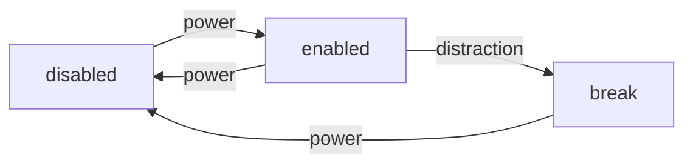

# UI Design

**states:**

- Disabled
- Enabled
- Break

**data:**

- Disabled
  - Time Working Today
- Enabled
  - Current Time Working
  - Should take break soon?
  - Is in "the zone"?
  - How many distractions?
- Break
  - How long is left in the break

options:
	- blocked websites
	- focus website
